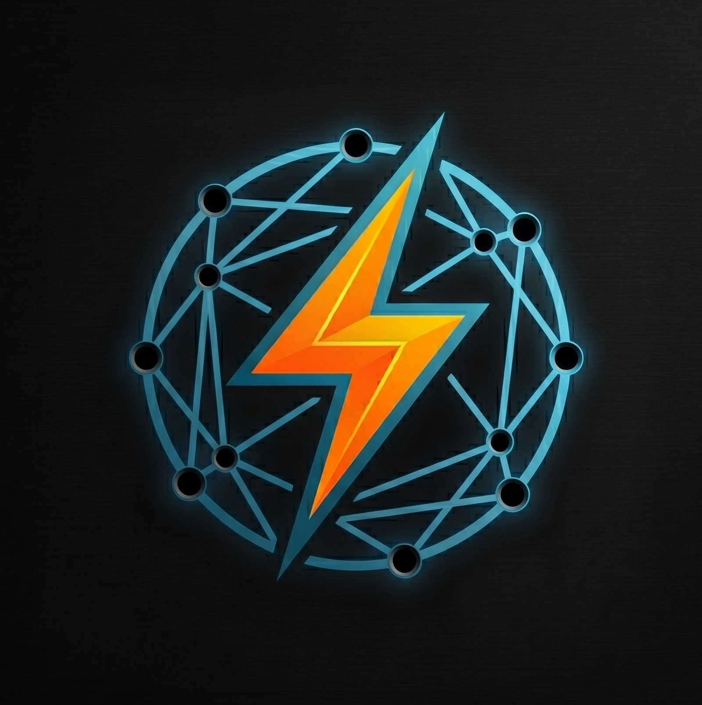

<p align="center">
  
</p>

<p align="center">
  
</p>

# IOT Lightning Bridge HACS

[](https://github.com/hacs/integration)
[](https://github.com/tzongocu/iot_lightning_bridge_hacs/releases)
[](https://opensource.org/licenses/MIT)

**Official bridge for integrating IOT Lightning devices into Home Assistant via MQTT.**

## 📬 Contact
- Email: [contact@botrift.com](mailto:contact@botrift.com)
- Creator: [https://botrift.com](https://botrift.com)

## 🎯 Features

- 🔌 **MQTT Discovery** - Automatic discovery in Home Assistant
- 🔐 **Token Authentication** - API token protection
- ⚡ **Lightning Network** - Full integration with Lightning networks
- 📊 **Real-time Control** - Instant commands via MQTT
- 🎨 **Config Flow UI** - Graphical configuration interface
- 🟢 **Availability Status** - Automatic online/offline reporting
- 📝 **Comprehensive Logging** - Detailed debug messages

## 📥 Installation

### Method 1: Install via HACS (Recommended)

1. Open **HACS** → **Integrations**
2. Click **⋮** (top-right) → **Custom repositories**
3. Add the URL: `https://github.com/yourusername/iot_lightning_bridge_hacs`
4. Select category: **Integration**
5. Click **Install**
6. **Restart Home Assistant**
7. Go to **Settings** → **Devices & Services** → **Add Integration**
8. Search for "IOT Lightning Bridge HACS"

### Method 2: Manual Install (Development)

```bash
# Clone the repository
git clone https://github.com/tzongocu/iot_lightning_bridge_hacs.git

# Copy into Home Assistant custom components
cp -r iot_lightning_bridge_hacs /config/custom_components/

# Restart Home Assistant
# Settings → System → Restart
```

### Method 3: Docker / HA OS

If you use **Docker** or **Home Assistant OS**:
1. Open the **File Editor** add-on (from Add-on Store)
2. Navigate to `/config/custom_components/`
3. Create folder: `iot_lightning_bridge_hacs`
4. Upload the repository files

## ⚙️ Configuration

### Via UI (Recommended)

After installation:
1. **Settings** → **Devices & Services**
2. Click **Create Integration** (or search for "IOT Lightning Bridge")
3. Fill the form:
   - **API Token**: Your authentication token
   - **MQTT Broker Prefix**: Topic prefix (e.g. `iot/lightning`)

Discovery behavior:
- The integration subscribes to `\{broker_prefix\}/#` and will create entities when it sees device messages.
- To allow automatic, immediate discovery on install, devices should either:
  - publish retained state messages under their topic (e.g. `iot/lightning/device123` retained), or
  - respond to an active discovery request: after subscribing, the integration publishes a discovery request to `{broker_prefix}/get` with payload `{"cmd":"whoareyou"}`; devices should reply on their own topic with their id/state.

### Via YAML (Optional)

```yaml
# configuration.yaml
iot_lightning_bridge_hacs:
  api_token: "your_token_here"
  broker_prefix: "iot/lightning"
```

## 📡 MQTT Topics

### Discovery (Home Assistant Detect)

```
homeassistant/switch/iot_lightning_bridge_hacs/bridge/config
```

**Payload:**
```json
{
  "name": "IOT Lightning Bridge",
  "unique_id": "iot_lightning_bridge_hacs_...",
  "state_topic": "iot/lightning/switch/bridge/state",
  "command_topic": "iot/lightning/switch/bridge/set",
  "availability_topic": "iot/lightning/availability",
  "device": {
    "identifiers": ["iot_lightning_bridge_hacs_..."],
    "name": "IOT Lightning Bridge",
    "manufacturer": "IOT Lightning",
    "model": "Bridge v1.0"
  }
}
```

### State (Status Update)

```
Topic: iot/lightning/switch/bridge/state
Payload: ON / OFF
QoS: 1, Retain: True
```

### Command (Control)

```
Topic: iot/lightning/switch/bridge/set
Payload: ON / OFF
QoS: 1
```

### Availability (Online/Offline)

```
Topic: iot/lightning/availability
Payload: online / offline
QoS: 1, Retain: True
```

## 🔍 Troubleshooting

### Integration does not appear in the UI?

```
1. Check logs: Settings → System → Logs
2. Search for: "iot_lightning_bridge_hacs"
3. Verify the MQTT integration is loaded
```

Common errors:
- ❌ `MQTT integration not loaded` → Configure MQTT in HA first
- ❌ `invalid_api_token` → Token too short (min. 3 characters)
- ❌ `invalid_broker_prefix` → Prefix cannot be empty

### MQTT not working?

```bash
# Check MQTT connection
mosquitto_sub -h <mqtt_broker> -t "homeassistant/switch/iot_lightning_bridge_hacs/#"

# You can view the discovery payload
mosquitto_sub -h <mqtt_broker> -t "iot/lightning/#"

If you want to trigger discovery manually, publish a discovery request:

```bash
# Ask devices to announce themselves (they should reply on their own topic)
mosquitto_pub -h <mqtt_broker> -t "iot/lightning/get" -m '{"cmd":"whoareyou"}'
```

Manual entity creation via service
---------------------------------

You can add entities manually via a Home Assistant service call. This is useful to pre-create entities
so they are available for automations before any device messages arrive.

Service: `iot_lightning_bridge_hacs.add_entity`
Payload:

```yaml
topic: "<prefix>/<device_id>"  # e.g. bogdan/dp8ipv3db1t930v
name: "Friendly Name"          # optional
entry_id: "<config_entry_id>"  # optional, if multiple entries exist
```

Example using `ha` CLI (or Developer Tools → Services):

```bash
# Add an entity and persist it in integration options
ha services call iot_lightning_bridge_hacs.add_entity '{"topic":"bogdan/dp8ipv3db1t930v","name":"Living Room Lamp"}'
```

When called, the service will:
- persist the topic+name in the integration's options (`manual_entities`),
- create the `switch` entity immediately in Home Assistant, and
- publish discovery/availability so the entity appears and can be used in automations.
```

### Check Home Assistant Logs

```
Settings → System → Logs
Filter: iot_lightning_bridge_hacs
```

Look for lines such as:
- `✓ Published MQTT Discovery`
- `✓ Published availability 'online'`
- `⚠️ MQTT component not available`
- `❌ Error publishing`

## 📋 Requirements

- **Home Assistant:** 2026.1.0+
- **MQTT Integration:** Configured and working
- **Python:** 3.11+
- **Libraries:** Only native Home Assistant components (no external dependencies)

## 📁 Project Structure

```
iot_lightning_bridge_hacs/
├── __init__.py              # Setup and lifecycle
├── config_flow.py           # Configuration form
├── const.py                 # Domain constants
├── switch.py                # Switch entity with MQTT
├── manifest.json            # Integration metadata
├── strings.json             # UI translations
├── README.md                # Documentation
└── LICENSE                  # MIT License
```

## 🚀 Development

### Setup Local Environment

```bash
# Clone repo
git clone https://github.com/yourusername/iot_lightning_bridge_hacs.git
cd iot_lightning_bridge_hacs

# Check Python syntax
python -m py_compile *.py

# Run tests (if added)
pytest tests/
```

### Contribution Workflow

1. Fork the repository
2. Create branch: `git checkout -b feature/my-feature`
3. Commit: `git commit -am 'Add my feature'`
4. Push: `git push origin feature/my-feature`
5. Open a Pull Request

## 📝 Changelog

### v1.0.0 (2026-06-07)
- 🎉 First public release
- ✅ MQTT Discovery complete
- ✅ Config Flow UI
- ✅ Availability status tracking
- ✅ Full async/await pattern

## 🆘 Support & Issues

- **Bugs:** [GitHub Issues](https://github.com/tzongocu/iot_lightning_bridge_hacs/issues)
- **Discussions:** [GitHub Discussions](https://github.com/tzongocu/iot_lightning_bridge_hacs/discussions)
- **Home Assistant Forum:** Mention `@tzongocu`

## 📄 License

[MIT License](LICENSE) - Free to use in commercial and personal projects

---

Made with ❤️ for Home Assistant

If this project was helpful, please give it a ⭐ on GitHub!
